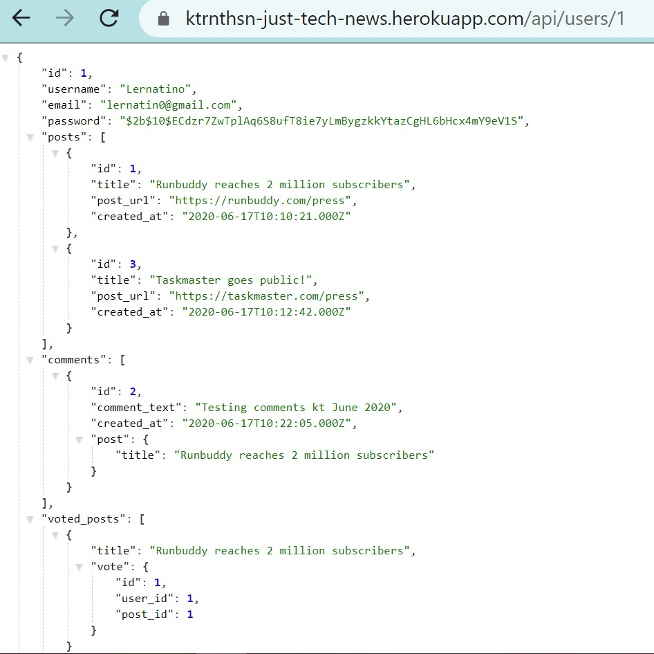

# just-tech-news
Just Tech News is a blog hosted in Heroku and the JawsDB add-on, showing through the Insomnia tool the API endpoints where users can post, upvote, and comment on links to news articles.

## GitHub URL
https://github.com/ktrnthsnr/just-tech-news

## Table of Contents
* [Description](#description)
* [Installations](#installations)
* [Usage](#usage)
* [Technology](#technology)
* [Contribution](#contribution)

## Description
- This repo contains the Just Tech News blog application, within a Node.js JavaScript platform. 
- The work for this project contains JavaScript configuration, MySQL2 commands, and Sequelize model scripts that query the backend database tables.
- Sequelize is a JavaScript library and a Promise based Node.js object relational mapping (ORM) package that acts as a dialect to various SQL server software like MySQL. The Sequalize ORM is used to interact between the Expres.js web server and the MySQL database. The Sequelize model script provides the query language to view, add, update or delete content from the database. Finally, the Express.js API route scripts will call the database using the Sequelize models or database queries. 
- For this application, the Sequelize ORM interacts with the Heroku JawsDB add-on which provides the MySQL database and holds the tables' content. The API endpoints for each query type can be viewed and tested via the debugging tool Insomnia, which can render GET, POST, PULL, and DELETE routes through its browser.

## Installations
- Prereq: install VSCode, Node.js, and MySQL http://dev.mysql.com/downloads/
- After cloning the GitHub repo to your local drive, run the following in the VSCode command-line terminal
- Install npm
- $ `npm init -y` or $ `npm install`
- Manaully update the package.json to  `"main": "server.js",` instead of index.js
- Create a .gitignore file in the root and add `node_modules` to this file
- If you need to re-add the dependencies, run $ `npm install`
- Install Express, Sequelize and mysql2
- $ `npm install express sequelize mysql2`
- Install NPM package dotenv to manage sensitive data, info https://www.npmjs.com/package/dotenv
- $ `npm install dotenv`
- To install the database for this project, you'll need a Heroku account with the JawsDB add-on. When uploaded to Heroku, add the process.env variables within the Heroku dashboard. For local testing, you can create an .env file to store your credentials. More info in the Testing.md
- For more info, https://elements.heroku.com/addons/jawsdb
- To install mysql manually (if not already installed per above)
- $ `npm install -g mysql`
- $ `npm install mysql2 --save`
- Install console.table to print MySQL in console
- $ `npm install console.table --save`
- Install bcrypt 
- `npm install bcrypt`

## Usage
- Within the VSCode terminal, start MySQL
-   $ `mysql -u root -p`
- Enter your MySQL password when prompted
- To create the database and run the schema script, enter in the MySQL2 command line,
- mysql> `source db/schema.sql`
- Validate the db was created, `show databases;` or by entering `use just_tech_news_db;`
- To populate the tables to test, see Testing.md for more info
- Start the server in terminal bash, which will create the tables if not already created
- $ `npm start`

- Insomnia GET sample

- Local site walkthrough of the GET, POST, PULL, DELETE API routes through Insomnia
https://drive.google.com/file/d/1KR7l8L7FI46ifa94_QorOl94-ma2Q5Ut/view

- Heroku sample GET URL for single user https://ktrnthsn-just-tech-news.herokuapp.com/api/users/1

- Heroku sample URLs, walkthrough within Insomnia for GET, POST, PULL, DELETE API endpoints
https://drive.google.com/file/d/1nr9taJsIYR6BMeG7Mw6yNCKMdY5inUOP/view

## Technology
Heroku JawsDB, MySQL, MySQL2, Express.js, Sequelize, Insomnia, Node.js, JavaScript, npm, HTML, CSS, bcrypt, dotenv

## Contribution
ktrnthsnr

### ©️2020 ktrnthsnr
